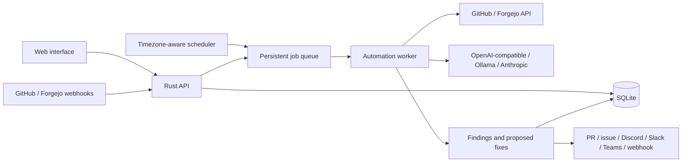

# Architecture

One Rust process serves the API and static web interface, accepts webhook deliveries, schedules jobs and processes the persistent queue. SQLite stores connection configuration, automation definitions and execution history. Provider and source-control adapters are independent of the storage layer.

## Execution boundary

The worker resolves an automation's stored connections and passes decrypted configuration to the engine in memory. Credentials are never included in model context. The model receives repository content and instructions, and returns findings or bounded file changes. Rust code validates those changes and checks the automation's configured permissions before publishing.

Source files, issues and comments are untrusted inputs. Instructions embedded in those inputs cannot enable write actions or choose arbitrary notification destinations. Connection URLs are administrator configuration because self-hosted services often use private network addresses. Credential-bearing HTTP requests do not follow redirects.

No shell tools, Git hooks, package scripts, or model-generated commands run inside the main container. Testing proposed code belongs to the repository's CI in the initial release. A future isolated runner must have a separate security boundary and its own scoped credentials.

## Durability and concurrency

Webhook signatures establish authenticity. Delivery identifiers prevent duplicated execution. Scheduled runs use a persisted occurrence identity. Manual retries receive a new run identity. The worker serializes execution to avoid simultaneous updates to a branch, while the HTTP server remains responsive.

Each run records its trigger, result, timestamps and status. Cancellation and timeouts stop further work. External writes completed before cancellation cannot be rolled back automatically; inspect the recorded platform links before repeating a fix.

## Analysis coverage

The repository tree identifies candidate files. Ignore patterns and file/context budgets bound retrieval and model calls. Reports show coverage and omissions, including binaries, generated content and oversized files. The model's verdict must not imply complete verification when the selected model or limits prevent it.

## Extending the application

- Add a source-control adapter for another repository platform.
- Add an AI adapter while preserving the structured findings/change contract.
- Add a notification adapter without exposing credentials to the model.
- Keep durable execution state in the core, and network/model behavior in the engine.

The shared HTTP and engine contracts are in `IMPLEMENTATION.md`. Secrets in configuration exports must remain redacted.
